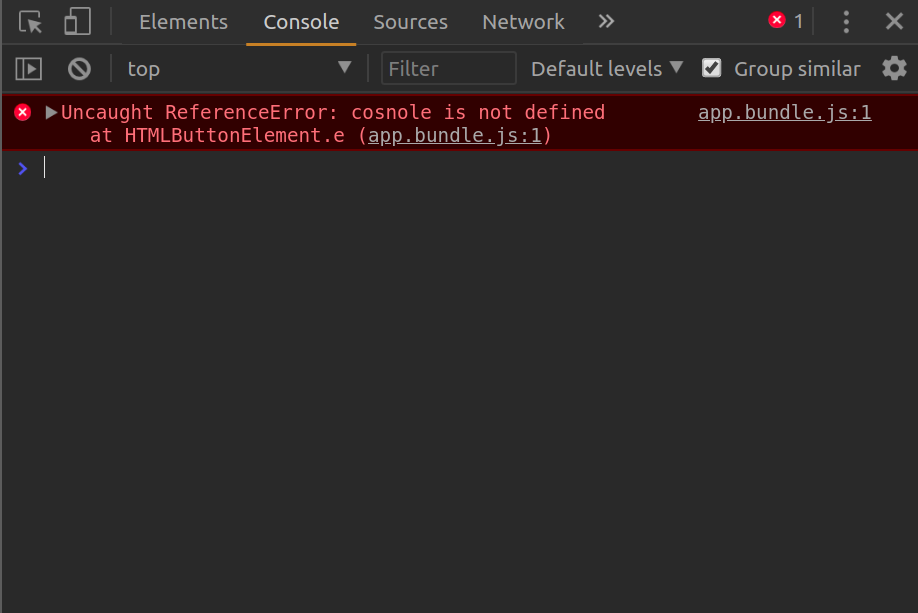
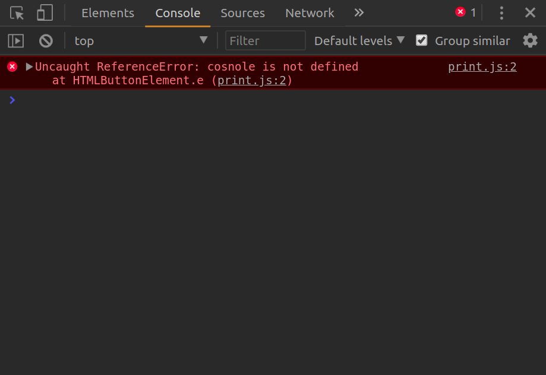

# My first Webpack
## Development Guide
<small>Previous: [Output Management](https://github.com/nawawishkid/webpack-demo/tree/output-management)</small>
<small>From: https://webpack.js.org/guides/development/</small>

### 1. Debug code ด้วย source map
จาก branch 'output-management' ถ้า code ในไฟล์ print.js ของเรามี bug มันก็จะขึ้นใน console ว่า bug มากจาก `app.bundle.js` แบบนี้

ซึ่งไม่ช่วยอะไรเลย  งั้นเรามาเพิ่ม devtool ที่ช่วยให้ debug ง่ายขึ้นโดยการเพิ่ม `devtool: 'inline-source-map'` เข้าไปใน `module.exports` object ใน `webpack.config.js`  
Debug จะออกมาแบบนี้:

The master branch is just a base branch for this repo, to see what I've learned, please looking at each branch.